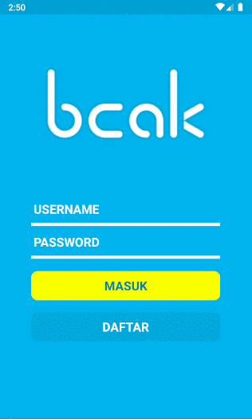

# React Native - Mobile Apps Mini Tracker

> Mobile app mini tracker, real-time traker dengan websocket.

### Dependencies yang digunakan:

1. @react-native-community/geolocation: ^2.0.2
2. react: 16.9.0
3. react-native: ^0.63.0
4. react-native-animatable: ^1.3.3
5. react-native-gesture-handler: ^1.5.5
6. react-native-maps: ^0.26.1
7. react-native-reanimated: ^1.7.0
8. react-native-router-flux: ^4.2.0
9. react-native-screens: ^2.0.0-alpha.33
10. react-redux: ^7.1.3
11. react-stomp: ^4.3.0
12. redux: ^4.0.5
13. redux-form: ^8.3.0
14. redux-persist: ^6.0.0
15. redux-thunk: ^2.3.0
16. typescript: ^3.7.5

### Devdependencies yang digunakan:

1. @babel/core: 7.8.4
2. @babel/runtime: 7.8.4
3. @react-native-community/eslint-config: 0.0.5
4. babel-jest: 24.9.0
5. eslint: ^6.8.0
6. jest: 24.9.0
7. jetifier: ^1.6.5
8. metro-react-native-babel-preset: 0.56.4
9. react-test-renderer: 16.9.0

### Installasi:

- Download atau clone repository
- Extract folder
- Install dependencies : `npm install` atau `yarn install`
- Jalankan pada emulator:  `yarn android` atau `yarn ios`
- Jalankan pada web: `run yarn start:web`

### Demo:

- Home:

    